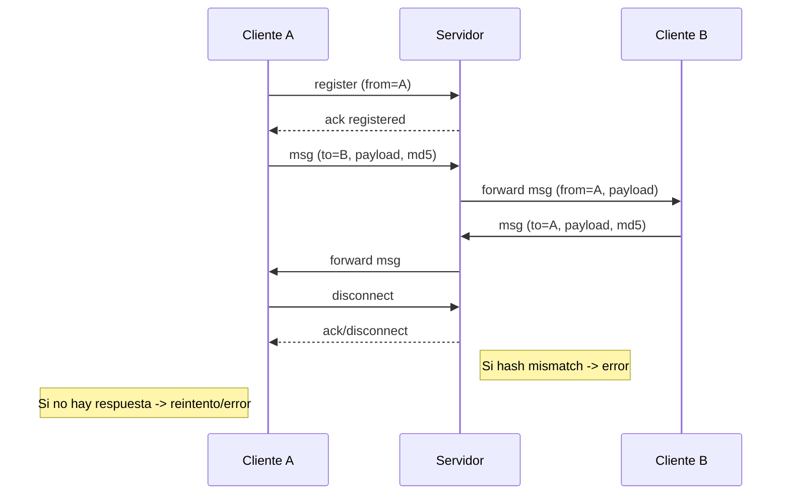

# Diagrama de Secuencia

```mermaid
sequenceDiagram
    participant A as Cliente A
    participant S as Servidor
    participant B as Cliente B

    A->>S: register (from=A)
    S-->>A: ack registered
    A->>S: msg (to=B, payload, md5)
    S->>B: forward msg (from=A, payload)
    B->>S: msg (to=A, payload, md5)
    S->>A: forward msg
    A->>S: disconnect
    S-->>A: ack/disconnect
    Note right of S: Si hash mismatch -> error
    Note left of A: Si no hay respuesta -> reintento/error
```
